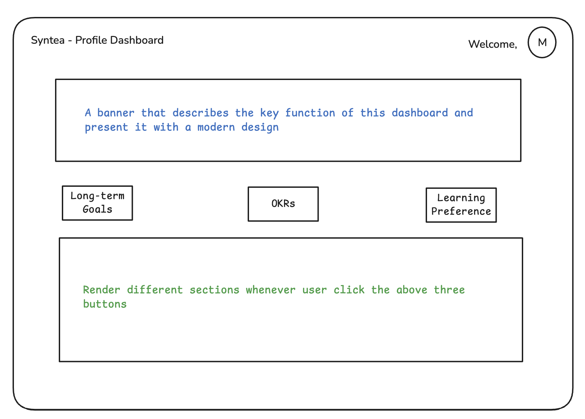

# vibe-coding

I don't know exactly what ['vibe coding'](https://en.wikipedia.org/wiki/Vibe_coding) means but it does sound very cool.

In this repository, we will create a simple dashboard center that will allow the user to:

- CRUD (Create, Read, Update, Delete) their long-term goals
- CRUD (Create, Read, Update, Delete) their OKRs
- CRUD (Create, Read, Update, Delete) their learning preferences

User experience and user interface is very important. We aim to create the best possible experience for the user.

## User Interface

- One page dashboard

The layout is clean, structured, and focuses on clarity. It comprises four main areas:

- Header
- Banner Section
- Navigation/Buttons Section
- Dynamic Content Section (Component-based rendering): long-term goals, OKRs, learning preferences